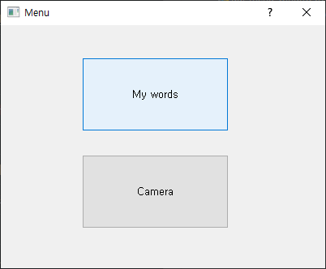
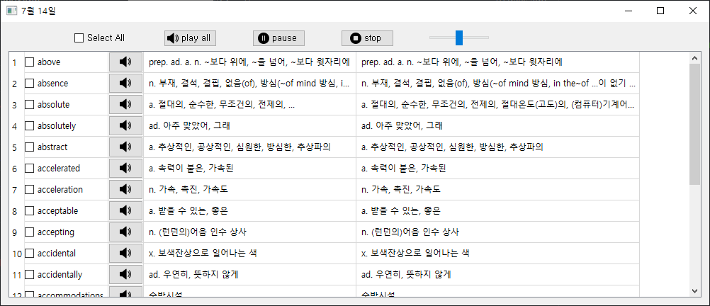
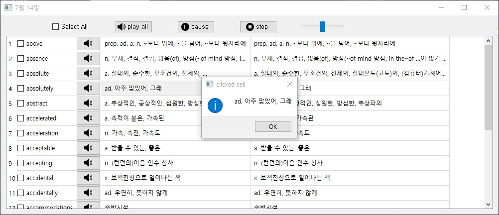
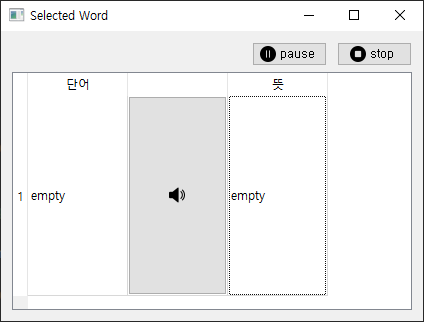

# Capston_Dicture-Pen
캡스톤 디자인
GUI 파트
------
1. Main Window

  

  - Words table Menu
  - Camera Menu

  [소스코드](gui_menu_window.py)
  
 2. Word Table
  
  
  
  - 엑셀 파일을 읽어와서 테이블에 표시
  - 단어를 선택하면 Selected Word 창 표시
  - 뜻을 선택하면 새로운 창에서 문장 전체 표시
  
  
  
  - 체크박스로 단어 선택

  [소스코드](gui_table_window.py)

3. Selected Word Window
  
  
  
  - 선택된 단어를 표시

   [소스코드](gui_selectedword_window.py)

--------
Python, PyQt5, mysql
